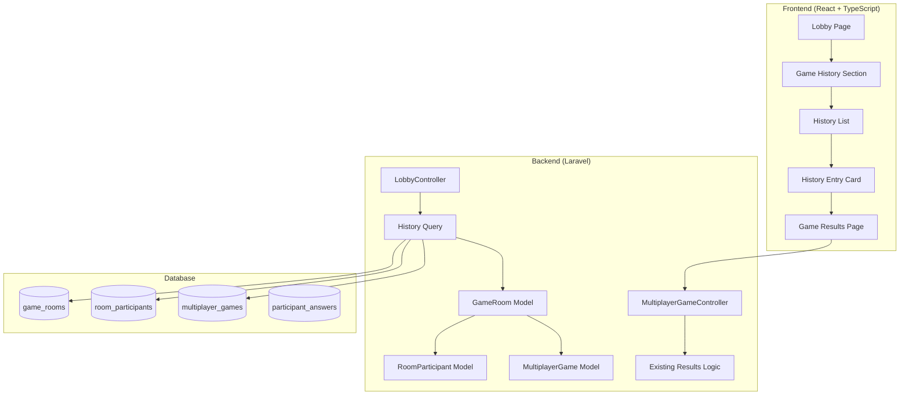

# Multiplayer Game History Design

## Overview

The game history feature extends the multiplayer lobby with a chronological view of recently completed games. It leverages existing database structures and relationships, adding minimal new infrastructure while providing quick access to past game results. The design focuses on efficient queries, clean UI integration, and reusing existing game results components.

## Architecture

### High-Level Architecture



### System Integration

The game history feature integrates seamlessly with existing components:
- **Database Schema**: Uses existing tables without modifications
- **Results Display**: Reuses existing game results page and components
- **Lobby UI**: Adds new section to existing lobby layout
- **Query Optimization**: Leverages existing indexes and relationships

## Components and Interfaces

### Backend Components

#### Controller Updates

**LobbyController Enhancement**
```php
class LobbyController extends Controller
{
    public function index(Request $request)
    {
        $user = $request->user();
        
        // Existing lobby data
        $availableRooms = $this->getAvailableRooms();
        
        // New: Game history
        $gameHistory = $this->getGameHistory($user);
        
        return Inertia::render('multiplayer/Lobby', [
            'availableRooms' => $availableRooms,
            'gameHistory' => $gameHistory,
        ]);
    }
    
    protected function getGameHistory(User $user): Collection
    {
        return GameRoom::query()
            ->where('status', RoomStatus::COMPLETED)
            ->where('updated_at', '>=', now()->subDays(7))
            ->whereHas('participants', function ($query) use ($user) {
                $query->where('user_id', $user->id);
            })
            ->with([
                'participants.user:id,name,email',
                'multiplayerGame.game',
                'settings',
            ])
            ->orderBy('updated_at', 'desc')
            ->limit(20)
            ->get()
            ->map(function ($room) use ($user) {
                return $this->formatHistoryEntry($room, $user);
            });
    }
    
    protected function formatHistoryEntry(GameRoom $room, User $user): array
    {
        $userParticipant = $room->participants
            ->firstWhere('user_id', $user->id);
        
        $rankedParticipants = $room->participants
            ->sortByDesc('score')
            ->values();
        
        $userPosition = $rankedParticipants
            ->search(fn($p) => $p->user_id === $user->id) + 1;
        
        return [
            'id' => $room->id,
            'room_code' => $room->room_code,
            'completed_at' => $room->updated_at,
            'participant_count' => $room->participants->count(),
            'participants_preview' => $rankedParticipants
                ->take(4)
                ->map(fn($p) => [
                    'id' => $p->user->id,
                    'name' => $p->user->name,
                    'score' => $p->score,
                ])
                ->values(),
            'user_score' => $userParticipant->score,
            'user_position' => $userPosition,
            'total_questions' => $room->multiplayerGame->game->total_questions,
            'difficulty' => $room->settings->difficulty,
            'category' => $room->settings->category_id,
        ];
    }
}
```

**MultiplayerGameController Enhancement**
```php
class MultiplayerGameController extends Controller
{
    public function results(GameRoom $room)
    {
        // Existing results logic works for both active and historical games
        // No changes needed - just ensure authorization allows viewing completed games
        
        $this->authorize('view', $room);
        
        // Existing implementation handles everything
        return $this->showResults($room);
    }
}
```

#### Authorization Policy

**GameRoomPolicy Addition**
```php
class GameRoomPolicy
{
    public function view(User $user, GameRoom $room): bool
    {
        // Allow viewing if user was a participant
        return $room->participants()
            ->where('user_id', $user->id)
            ->exists();
    }
}
```

### Frontend Components

#### Component Structure

```
components/
├── multiplayer/
│   ├── GameHistory.tsx           # Main history section container
│   ├── HistoryEntry.tsx          # Individual game card
│   ├── HistoryEmptyState.tsx    # Empty state when no history
│   └── ParticipantAvatars.tsx   # Stacked avatar display
```

#### Component Implementations

**GameHistory.tsx**
```typescript
interface GameHistoryProps {
  gameHistory: HistoryEntry[];
}

interface HistoryEntry {
  id: number;
  room_code: string;
  completed_at: string;
  participant_count: number;
  participants_preview: ParticipantPreview[];
  user_score: number;
  user_position: number;
  total_questions: number;
  difficulty: string;
  category?: number;
}

interface ParticipantPreview {
  id: number;
  name: string;
  score: number;
}

export function GameHistory({ gameHistory }: GameHistoryProps) {
  if (gameHistory.length === 0) {
    return <HistoryEmptyState />;
  }

  return (
    <div className="space-y-4">
      <div className="flex items-center justify-between">
        <h2 className="text-lg font-semibold">Recent Games</h2>
        <span className="text-sm text-muted-foreground">
          Last 7 days
        </span>
      </div>
      
      <div className="space-y-2">
        {gameHistory.map((entry) => (
          <HistoryEntry key={entry.id} entry={entry} />
        ))}
      </div>
    </div>
  );
}
```

**HistoryEntry.tsx**
```typescript
interface HistoryEntryProps {
  entry: HistoryEntry;
}

export function HistoryEntry({ entry }: HistoryEntryProps) {
  const completedDate = formatDistanceToNow(
    new Date(entry.completed_at),
    { addSuffix: true }
  );

  return (
    <Link
      href={route('multiplayer.game.results', { room: entry.room_code })}
      className="block"
    >
      <Card className="hover:bg-accent transition-colors cursor-pointer">
        <CardContent className="p-4">
          <div className="flex items-center justify-between">
            <div className="flex-1 space-y-1">
              <div className="flex items-center gap-2">
                <Badge variant="outline">
                  {getPositionLabel(entry.user_position)}
                </Badge>
                <span className="text-sm text-muted-foreground">
                  {completedDate}
                </span>
              </div>
              
              <div className="flex items-center gap-4">
                <div className="text-sm">
                  <span className="font-medium">{entry.user_score}</span>
                  <span className="text-muted-foreground">
                    {' '}/ {entry.total_questions * 100} pts
                  </span>
                </div>
                
                <div className="text-sm text-muted-foreground">
                  {entry.participant_count} players
                </div>
                
                <Badge variant="secondary" className="text-xs">
                  {entry.difficulty}
                </Badge>
              </div>
            </div>
            
            <div className="flex items-center gap-3">
              <ParticipantAvatars
                participants={entry.participants_preview}
                total={entry.participant_count}
              />
              <ChevronRight className="h-4 w-4 text-muted-foreground" />
            </div>
          </div>
        </CardContent>
      </Card>
    </Link>
  );
}

function getPositionLabel(position: number): string {
  if (position === 1) return '🥇 1st Place';
  if (position === 2) return '🥈 2nd Place';
  if (position === 3) return '🥉 3rd Place';
  return `#${position}`;
}
```

**ParticipantAvatars.tsx**
```typescript
interface ParticipantAvatarsProps {
  participants: ParticipantPreview[];
  total: number;
}

export function ParticipantAvatars({ 
  participants, 
  total 
}: ParticipantAvatarsProps) {
  const displayParticipants = participants.slice(0, 3);
  const remaining = total - displayParticipants.length;

  return (
    <div className="flex -space-x-2">
      {displayParticipants.map((participant) => (
        <Avatar
          key={participant.id}
          className="border-2 border-background h-8 w-8"
        >
          <AvatarFallback className="text-xs">
            {getInitials(participant.name)}
          </AvatarFallback>
        </Avatar>
      ))}
      
      {remaining > 0 && (
        <Avatar className="border-2 border-background h-8 w-8">
          <AvatarFallback className="text-xs bg-muted">
            +{remaining}
          </AvatarFallback>
        </Avatar>
      )}
    </div>
  );
}
```

**HistoryEmptyState.tsx**
```typescript
export function HistoryEmptyState() {
  return (
    <Card className="border-dashed">
      <CardContent className="flex flex-col items-center justify-center py-12 text-center">
        <History className="h-12 w-12 text-muted-foreground mb-4" />
        <h3 className="font-semibold mb-2">No Recent Games</h3>
        <p className="text-sm text-muted-foreground max-w-sm">
          Your completed multiplayer games from the last 7 days will appear here.
          Create or join a room to start playing!
        </p>
      </CardContent>
    </Card>
  );
}
```

#### Lobby Page Integration

**Lobby.tsx Update**
```typescript
interface LobbyProps {
  availableRooms: Room[];
  gameHistory: HistoryEntry[];
}

export default function Lobby({ availableRooms, gameHistory }: LobbyProps) {
  return (
    <AppLayout>
      <div className="container mx-auto py-8 space-y-8">
        {/* Existing room browser section */}
        <section>
          <RoomBrowser rooms={availableRooms} />
        </section>
        
        {/* New game history section */}
        <section>
          <GameHistory gameHistory={gameHistory} />
        </section>
      </div>
    </AppLayout>
  );
}
```

## Data Models

### Database Schema

No new tables required. The feature uses existing schema:

```sql
-- Existing tables used for history
game_rooms (
  id, room_code, host_user_id, status, 
  updated_at, -- Used for completion timestamp and 7-day filter
  ...
)

room_participants (
  id, room_id, user_id, score, 
  joined_at,
  ...
)

multiplayer_games (
  id, room_id, game_id, 
  current_question_index,
  ...
)

games (
  id, total_questions, difficulty, category_id,
  ...
)
```

### Required Indexes

```sql
-- Optimize history queries
CREATE INDEX idx_game_rooms_status_updated 
ON game_rooms(status, updated_at DESC);

-- Optimize participant lookups
CREATE INDEX idx_room_participants_user_room 
ON room_participants(user_id, room_id);
```

### TypeScript Interfaces

```typescript
interface HistoryEntry {
  id: number;
  room_code: string;
  completed_at: string;
  participant_count: number;
  participants_preview: ParticipantPreview[];
  user_score: number;
  user_position: number;
  total_questions: number;
  difficulty: 'easy' | 'medium' | 'hard';
  category?: number;
}

interface ParticipantPreview {
  id: number;
  name: string;
  score: number;
}

interface GameHistoryProps {
  gameHistory: HistoryEntry[];
}
```

## Error Handling

### Backend Error Scenarios

**Missing Game Data**
```php
protected function formatHistoryEntry(GameRoom $room, User $user): ?array
{
    // Handle cases where multiplayer game or participants are missing
    if (!$room->multiplayerGame || !$room->multiplayerGame->game) {
        Log::warning("Incomplete game data for room {$room->id}");
        return null;
    }
    
    $userParticipant = $room->participants
        ->firstWhere('user_id', $user->id);
    
    if (!$userParticipant) {
        Log::warning("User {$user->id} not found in room {$room->id} participants");
        return null;
    }
    
    // ... rest of formatting
}
```

**Authorization Failures**
```php
public function results(GameRoom $room)
{
    try {
        $this->authorize('view', $room);
    } catch (AuthorizationException $e) {
        return redirect()
            ->route('multiplayer.lobby')
            ->with('error', 'You do not have access to this game.');
    }
    
    return $this->showResults($room);
}
```

### Frontend Error Handling

**Failed History Load**
```typescript
export function GameHistory({ gameHistory }: GameHistoryProps) {
  if (!gameHistory) {
    return (
      <Card>
        <CardContent className="p-8 text-center">
          <p className="text-muted-foreground">
            Unable to load game history. Please try again.
          </p>
        </CardContent>
      </Card>
    );
  }
  
  // ... rest of component
}
```

**Navigation Errors**
```typescript
function handleHistoryClick(entry: HistoryEntry) {
  try {
    router.visit(route('multiplayer.game.results', { room: entry.room_code }));
  } catch (error) {
    toast.error('Unable to load game results');
    console.error('Navigation error:', error);
  }
}
```

## Testing Strategy

### Unit Testing

**Backend Service Tests**
```php
test('getGameHistory returns only completed games from last 7 days', function () {
    $user = User::factory()->create();
    
    // Create completed game within 7 days
    $recentRoom = GameRoom::factory()
        ->completed()
        ->create(['updated_at' => now()->subDays(3)]);
    RoomParticipant::factory()->create([
        'room_id' => $recentRoom->id,
        'user_id' => $user->id,
    ]);
    
    // Create old completed game (should be excluded)
    $oldRoom = GameRoom::factory()
        ->completed()
        ->create(['updated_at' => now()->subDays(10)]);
    RoomParticipant::factory()->create([
        'room_id' => $oldRoom->id,
        'user_id' => $user->id,
    ]);
    
    // Create cancelled game (should be excluded)
    $cancelledRoom = GameRoom::factory()
        ->cancelled()
        ->create(['updated_at' => now()->subDays(1)]);
    RoomParticipant::factory()->create([
        'room_id' => $cancelledRoom->id,
        'user_id' => $user->id,
    ]);
    
    $controller = new LobbyController();
    $history = $controller->getGameHistory($user);
    
    expect($history)->toHaveCount(1);
    expect($history->first()['id'])->toBe($recentRoom->id);
});

test('formatHistoryEntry calculates user position correctly', function () {
    $user = User::factory()->create();
    $room = GameRoom::factory()->completed()->create();
    
    // Create participants with different scores
    RoomParticipant::factory()->create([
        'room_id' => $room->id,
        'user_id' => User::factory()->create()->id,
        'score' => 300,
    ]);
    RoomParticipant::factory()->create([
        'room_id' => $room->id,
        'user_id' => $user->id,
        'score' => 200,
    ]);
    RoomParticipant::factory()->create([
        'room_id' => $room->id,
        'user_id' => User::factory()->create()->id,
        'score' => 100,
    ]);
    
    $controller = new LobbyController();
    $entry = $controller->formatHistoryEntry($room, $user);
    
    expect($entry['user_position'])->toBe(2);
    expect($entry['user_score'])->toBe(200);
});
```

**Frontend Component Tests**
```typescript
describe('HistoryEntry', () => {
  it('displays correct position badge for 1st place', () => {
    const entry = createMockEntry({ user_position: 1 });
    render(<HistoryEntry entry={entry} />);
    
    expect(screen.getByText('🥇 1st Place')).toBeInTheDocument();
  });
  
  it('shows participant count correctly', () => {
    const entry = createMockEntry({ participant_count: 5 });
    render(<HistoryEntry entry={entry} />);
    
    expect(screen.getByText('5 players')).toBeInTheDocument();
  });
  
  it('navigates to results page on click', () => {
    const entry = createMockEntry({ room_code: 'ABC123' });
    render(<HistoryEntry entry={entry} />);
    
    const card = screen.getByRole('link');
    expect(card).toHaveAttribute(
      'href',
      route('multiplayer.game.results', { room: 'ABC123' })
    );
  });
});
```

### Integration Testing

**Full History Flow**
```php
test('user can view game history and access results', function () {
    $user = User::factory()->create();
    
    // Create completed game
    $room = GameRoom::factory()->completed()->create();
    RoomParticipant::factory()->create([
        'room_id' => $room->id,
        'user_id' => $user->id,
        'score' => 250,
    ]);
    
    // Visit lobby
    $response = $this->actingAs($user)
        ->get(route('multiplayer.lobby'));
    
    $response->assertOk();
    $response->assertInertia(fn($page) => 
        $page->has('gameHistory', 1)
            ->where('gameHistory.0.room_code', $room->room_code)
    );
    
    // Access results from history
    $response = $this->actingAs($user)
        ->get(route('multiplayer.game.results', ['room' => $room->room_code]));
    
    $response->assertOk();
});
```

## Performance Considerations

### Database Optimization

**Query Efficiency**
```php
// Efficient query with proper eager loading
GameRoom::query()
    ->where('status', RoomStatus::COMPLETED)
    ->where('updated_at', '>=', now()->subDays(7))
    ->whereHas('participants', function ($query) use ($user) {
        $query->where('user_id', $user->id);
    })
    ->with([
        'participants.user:id,name,email',  // Only load needed fields
        'multiplayerGame.game:id,total_questions,difficulty,category_id',
        'settings:id,room_id,difficulty,category_id',
    ])
    ->orderBy('updated_at', 'desc')
    ->limit(20)  // Prevent excessive data loading
    ->get();
```

**Index Strategy**
- Composite index on `(status, updated_at)` for efficient filtering
- Index on `room_participants(user_id, room_id)` for participant lookups
- Existing indexes on foreign keys support eager loading

### Caching Strategy

```php
protected function getGameHistory(User $user): Collection
{
    return Cache::remember(
        "game_history:{$user->id}",
        now()->addMinutes(5),
        fn() => $this->queryGameHistory($user)
    );
}

// Invalidate cache when new game completes
public function completeGame(GameRoom $room): void
{
    $room->update(['status' => RoomStatus::COMPLETED]);
    
    // Clear cache for all participants
    $room->participants->each(function ($participant) {
        Cache::forget("game_history:{$participant->user_id}");
    });
}
```

### Frontend Optimization

- Lazy load history section if below fold
- Virtualize list if history exceeds 50 entries
- Optimize avatar images with proper sizing
- Use React.memo for HistoryEntry components

This design provides a clean, efficient game history feature that integrates seamlessly with existing multiplayer infrastructure while maintaining performance and user experience standards.
