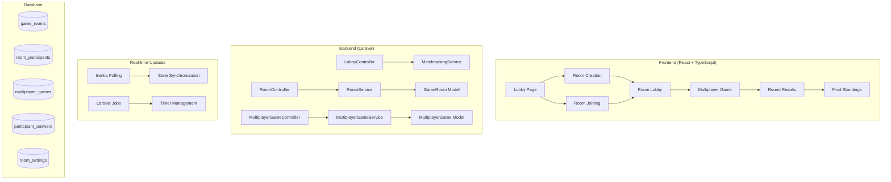

# Multiplayer Trivia Game Design

## Overview

The multiplayer trivia system extends the existing single-player game with real-time collaborative features. It uses Inertia.js polling for synchronization, maintains separate controllers for clarity, and leverages Laravel jobs for automated game progression. The design prioritizes simplicity and reliability over complex real-time infrastructure.

## Architecture

### High-Level Architecture



### System Integration

The multiplayer system integrates with existing components:
- **Question System**: Reuses existing question fetching and validation logic
- **User Authentication**: Leverages existing Fortify authentication
- **Database**: Extends current schema with multiplayer-specific tables
- **Frontend Components**: Builds upon existing UI components and patterns

## Components and Interfaces

### Backend Components

#### Controllers

**RoomController**
- Handles room lifecycle: creation, joining, leaving
- Manages room settings and host privileges
- Implements room code validation and capacity checks
- Returns room state for polling endpoints

**MultiplayerGameController**
- Orchestrates multiplayer game flow
- Handles answer submissions with timing validation
- Manages question progression and scoring
- Provides game state for real-time updates

**LobbyController**
- Displays available public rooms
- Implements room discovery and filtering
- Handles quick-match functionality

#### Services

**RoomService**
- Room lifecycle management (create, join, leave, cleanup)
- Participant management and status tracking
- Room code generation and validation
- Host privilege management and transfer

**MultiplayerGameService**
- Game orchestration and state management
- Question timing and automatic progression
- Scoring calculation and leaderboard generation
- Integration with existing question services

**MatchmakingService**
- Auto-matching players with similar preferences
- Room recommendation algorithms
- Quick-match room creation

#### Models and Relationships

```php
// GameRoom Model
class GameRoom extends Model
{
    protected $fillable = ['room_code', 'host_user_id', 'max_players', 'status'];
    
    public function host() { return $this->belongsTo(User::class, 'host_user_id'); }
    public function participants() { return $this->hasMany(RoomParticipant::class); }
    public function settings() { return $this->hasOne(RoomSettings::class); }
    public function multiplayerGame() { return $this->hasOne(MultiplayerGame::class); }
}

// RoomParticipant Model
class RoomParticipant extends Model
{
    public function room() { return $this->belongsTo(GameRoom::class); }
    public function user() { return $this->belongsTo(User::class); }
    public function answers() { return $this->hasMany(ParticipantAnswer::class); }
}

// MultiplayerGame Model (extends Game functionality)
class MultiplayerGame extends Model
{
    public function room() { return $this->belongsTo(GameRoom::class); }
    public function game() { return $this->belongsTo(Game::class); }
    public function participantAnswers() { return $this->hasMany(ParticipantAnswer::class); }
}
```

### Frontend Components

#### Component Hierarchy

```
pages/
├── multiplayer/
│   ├── lobby.tsx              # Main lobby with room browser
│   ├── room/[code].tsx        # Room lobby and game container
│   └── game/[code].tsx        # Active multiplayer game
│
components/
├── multiplayer/
│   ├── room-lobby.tsx         # Pre-game participant management
│   ├── participant-list.tsx   # Live participant display with status
│   ├── room-settings.tsx      # Host configuration panel
│   ├── multiplayer-question.tsx # Question with timer and status
│   ├── round-results.tsx      # Post-question leaderboard
│   └── final-standings.tsx    # Game completion results
├── lobby/
│   ├── room-browser.tsx       # Public room discovery
│   ├── create-room-modal.tsx  # Room creation form
│   ├── join-room-modal.tsx    # Code entry interface
│   └── room-code-input.tsx    # Specialized 6-char input
└── shared/
    ├── game-timer.tsx         # Shared countdown component
    └── answer-status.tsx      # Live answer indicators
```

#### Key Component Interfaces

```typescript
interface RoomLobbyProps {
  room: GameRoom;
  participants: Participant[];
  isHost: boolean;
  canStart: boolean;
}

interface MultiplayerQuestionProps {
  room: GameRoom;
  question: Question;
  timeRemaining: number;
  participants: Participant[];
  onAnswerSubmit: (answer: string) => void;
}

interface RoundResultsProps {
  room: GameRoom;
  question: Question;
  participants: ParticipantWithResults[];
  scoreChanges: ScoreChange[];
}
```

## Data Models

### Database Schema

```sql
-- Game rooms for multiplayer sessions
CREATE TABLE game_rooms (
    id BIGINT PRIMARY KEY AUTO_INCREMENT,
    room_code VARCHAR(6) UNIQUE NOT NULL,
    host_user_id BIGINT NOT NULL,
    max_players INT DEFAULT 8,
    current_players INT DEFAULT 0,
    status ENUM('waiting', 'starting', 'active', 'completed', 'cancelled') DEFAULT 'waiting',
    created_at TIMESTAMP,
    updated_at TIMESTAMP,
    expires_at TIMESTAMP,
    
    INDEX idx_room_code (room_code),
    INDEX idx_status (status),
    INDEX idx_host (host_user_id),
    FOREIGN KEY (host_user_id) REFERENCES users(id) ON DELETE CASCADE
);

-- Participants in rooms
CREATE TABLE room_participants (
    id BIGINT PRIMARY KEY AUTO_INCREMENT,
    room_id BIGINT NOT NULL,
    user_id BIGINT NOT NULL,
    status ENUM('joined', 'ready', 'playing', 'finished', 'disconnected') DEFAULT 'joined',
    score INT DEFAULT 0,
    joined_at TIMESTAMP,
    
    UNIQUE KEY unique_room_user (room_id, user_id),
    INDEX idx_room_status (room_id, status),
    FOREIGN KEY (room_id) REFERENCES game_rooms(id) ON DELETE CASCADE,
    FOREIGN KEY (user_id) REFERENCES users(id) ON DELETE CASCADE
);

-- Room configuration settings
CREATE TABLE room_settings (
    id BIGINT PRIMARY KEY AUTO_INCREMENT,
    room_id BIGINT NOT NULL,
    time_per_question INT DEFAULT 30,
    scoring_mode ENUM('standard') DEFAULT 'standard',
    category_id INT NULL,
    difficulty ENUM('easy', 'medium', 'hard') DEFAULT 'medium',
    total_questions INT DEFAULT 10,
    
    FOREIGN KEY (room_id) REFERENCES game_rooms(id) ON DELETE CASCADE
);

-- Multiplayer games (extends single-player games)
CREATE TABLE multiplayer_games (
    id BIGINT PRIMARY KEY AUTO_INCREMENT,
    room_id BIGINT NOT NULL,
    game_id BIGINT NOT NULL,
    current_question_index INT DEFAULT 0,
    question_started_at TIMESTAMP NULL,
    status ENUM('waiting', 'active', 'showing_results', 'completed') DEFAULT 'waiting',
    
    FOREIGN KEY (room_id) REFERENCES game_rooms(id) ON DELETE CASCADE,
    FOREIGN KEY (game_id) REFERENCES games(id) ON DELETE CASCADE
);

-- Participant answers with timing
CREATE TABLE participant_answers (
    id BIGINT PRIMARY KEY AUTO_INCREMENT,
    multiplayer_game_id BIGINT NOT NULL,
    participant_id BIGINT NOT NULL,
    question_id BIGINT NOT NULL,
    selected_answer TEXT NOT NULL,
    is_correct BOOLEAN NOT NULL,
    answered_at TIMESTAMP NOT NULL,
    response_time_ms INT NOT NULL,
    
    INDEX idx_game_participant (multiplayer_game_id, participant_id),
    INDEX idx_answered_at (answered_at),
    FOREIGN KEY (multiplayer_game_id) REFERENCES multiplayer_games(id) ON DELETE CASCADE,
    FOREIGN KEY (participant_id) REFERENCES room_participants(id) ON DELETE CASCADE,
    FOREIGN KEY (question_id) REFERENCES questions(id)
);
```

### TypeScript Interfaces

```typescript
interface GameRoom {
  id: number;
  room_code: string;
  host_user_id: number;
  max_players: number;
  current_players: number;
  status: 'waiting' | 'starting' | 'active' | 'completed' | 'cancelled';
  settings: RoomSettings;
  participants: Participant[];
  expires_at: string;
}

interface Participant {
  id: number;
  user: User;
  status: 'joined' | 'ready' | 'playing' | 'finished' | 'disconnected';
  score: number;
  has_answered_current: boolean;
  position?: number;
  joined_at: string;
}

interface RoomSettings {
  time_per_question: number;
  scoring_mode: 'standard';
  category_id?: number;
  difficulty: 'easy' | 'medium' | 'hard';
  total_questions: number;
}

interface MultiplayerGameState {
  room: GameRoom;
  current_question?: Question;
  current_question_index: number;
  time_remaining: number;
  participants: Participant[];
  round_results?: RoundResults;
}

interface RoundResults {
  question: Question;
  correct_answer: string;
  participant_results: ParticipantResult[];
  leaderboard: LeaderboardEntry[];
}
```

## Real-Time Communication

### Polling Strategy

The system uses Inertia.js polling with dynamic intervals based on game state:

```typescript
// Lobby phase - moderate updates for participant changes
const lobbyPolling = usePoll(3000, {
  only: ['room', 'participants'],
  onSuccess: handleLobbyUpdate
});

// Active game - frequent updates for timer and status
const gamePolling = usePoll(1000, {
  only: ['room', 'participants', 'currentQuestion', 'timeRemaining'],
  onSuccess: handleGameUpdate
});

// Results phase - infrequent updates
const resultsPolling = usePoll(5000, {
  only: ['room', 'roundResults', 'finalStandings'],
  onSuccess: handleResultsUpdate
});
```

### State Synchronization

**Server-Side State Management:**
- Room state stored in database with proper indexing
- Question timing calculated server-side using timestamps
- Participant status tracked in real-time
- Automatic state transitions via Laravel jobs

**Client-Side Optimization:**
- Conditional polling based on game phase
- Optimistic UI updates for immediate feedback
- Error handling with automatic retry
- Graceful degradation during network issues

## Error Handling

### Connection Management

```typescript
const useRoomPolling = (roomCode: string, gamePhase: GamePhase) => {
  const [connectionStatus, setConnectionStatus] = useState<'connected' | 'reconnecting' | 'disconnected'>('connected');
  
  const { data, error } = usePoll(
    getPollingInterval(gamePhase),
    {
      only: getPollingFields(gamePhase),
      onSuccess: () => setConnectionStatus('connected'),
      onError: (error) => {
        setConnectionStatus('reconnecting');
        // Implement exponential backoff
      }
    }
  );
  
  return { data, connectionStatus };
};
```

### Error Recovery

**Room Management Errors:**
- Invalid room codes: Clear error messages with retry options
- Capacity exceeded: Waitlist functionality or alternative room suggestions
- Host abandonment: Automatic host transfer to next participant
- Room expiration: Graceful cleanup with participant notification

**Game Flow Errors:**
- Answer submission conflicts: Server-side validation with timing tolerance
- Timer synchronization issues: Server-authoritative timing with client display
- Participant disconnections: Continue game with disconnected player tracking
- Network interruptions: Automatic reconnection with state recovery

## Testing Strategy

### Unit Testing

**Backend Services:**
- Room creation and code generation
- Participant management and status tracking
- Answer validation and scoring logic
- Timer calculation and progression

**Frontend Components:**
- Room lobby participant display
- Real-time timer updates
- Answer submission handling
- Connection status management

### Integration Testing

**Multiplayer Flow Testing:**
- Complete game flow from room creation to completion
- Multiple participant scenarios with concurrent actions
- Host privilege management and transfer
- Real-time synchronization accuracy

**Performance Testing:**
- Concurrent room capacity testing
- Polling performance under load
- Database query optimization validation
- Memory usage during long-running games

### End-to-End Testing

**User Journey Testing:**
- Room creation and sharing workflow
- Joining rooms via codes
- Complete multiplayer game experience
- Error scenarios and recovery

**Cross-Browser Testing:**
- Polling compatibility across browsers
- Timer synchronization accuracy
- Real-time update consistency
- Mobile responsiveness

## Performance Considerations

### Database Optimization

- Proper indexing on room_code, status, and foreign keys
- Efficient participant counting queries
- Batch operations for score calculations
- Automatic cleanup of expired rooms

### Polling Optimization

- Dynamic intervals based on game state
- Selective data fetching using Inertia's `only` parameter
- Connection pooling and request batching
- Caching of frequently accessed room data

### Scalability

- Redis caching for active room states
- Queue-based job processing for game progression
- Database connection optimization
- CDN integration for static assets

This design provides a robust foundation for multiplayer trivia functionality while maintaining simplicity and reliability. The polling-based approach avoids complex WebSocket infrastructure while still providing responsive real-time updates.